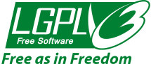
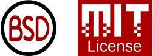
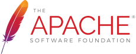

Everyone knows the frustration a misbehaving printer can cause. In 1989 a bug in a laser printer software annoyed Richard Stallman so much that he decided to fix it himself. However, he felt that the printer's manufacturer shouldn't be able to absorb his work into their proprietary software source code, feeling strongly that if he contributed his work to the world, the world should be able to use it, modify it, and distribute their changes so that everyone could benefit from their collaborative work.

This led to the first open-source license, the GNU Public License, or the GPL.

Since then a number of different popular licenses have been created to allow for more or less permissive usage of open-source software, and in this article, I'll take a look at what they are, and at the end provide an overview of why you could choose one over the other.

For the unix history aficionado, GNU in the GNU Public License stands for GNU is Not Unix. It's a recursive joke.

## GPL

The GNU General Public License (GPL) is a widely-used free software license that grants users the freedom to use, study, share, and modify the software it covers. The GPL is based on the principles of the "copyleft" license, which ensures that derivative works of the licensed software must also be distributed under the same GPL terms. This ensures that the freedoms granted by the GPL are preserved in any modifications or distributions of the software.

This does mean that if you use GPL code in your own project, your project must also be GPL licensed. This makes it the most purist license, however, because of this it is of limited use in settings where companies want to drive maximum adoption of their code. Licensing a company's SDK under the GPL would prevent other companies from using the SDK in their own close source software for example.

There are several versions of the GPL, but the most commonly used are:

**GPL version 2 (GPLv2)** - Released in 1991, GPLv2 is a widely used license that provides users with the freedom to run, study, share, and modify the software. However, it requires that any changes made to the code be released under the same GPLv2 terms, ensuring that the same freedoms are passed on to future users.

**GPL version 3 (GPLv3)** - Released in 2007, GPLv3 is an updated version of the license that addresses some of the legal and technological challenges faced by GPLv2. It provides more explicit protection against software patents, offers better compatibility with other free software licenses, and includes provisions to prevent the use of GPL-covered software in systems that restrict users' freedoms (such as DRM or "tivoization").

## LGPL

The LGPL was initially called the Library GPL but was later renamed to the Lesser GPL. It maintained the strong opinion of what makes something true open-source software, however, it includes text that allows a close source project to use an LGPL library, as long as it's linked in as a binary library file, and the source code of it is not mixed with the source code of the close source project.

This helped resolve some of the issues the open-source ecosystem had in the early days, where companies like Intel and Oracle wanted to port their software to run on Linux, however, they couldn't link to the GNU libraries on the system under the GPL while keeping their own code private.

Later the LGPL lost its popularity as the BSD, MIT, and Apache 2 licenses became the preferred choice for many.

## BSD and MIT licenses

The MIT license and the BSD license are two popular open-source permissive licenses. They grant users the freedom to use, study, share, and modify the software with minimal restrictions, making them more permissive than the GPL license.

The MIT license is a short and simple permissive open-source license that originated at the Massachusetts Institute of Technology. It allows users to freely use, modify, distribute, and sublicense the software, as long as the license and copyright notice is included in all copies or substantial portions of the software. The MIT license does not impose any copyleft requirements, which means that derivative works can be distributed under different terms, including proprietary licenses.

The key features of the MIT license are:

- Freedom to use, modify, distribute, and sublicense the software.
- Requirement to include the copyright notice and license text in all copies or substantial portions of the software.
- No warranty or liability for the software is provided by the copyright holder.
- No copyleft requirement, allowing derivative works to be distributed under different licenses.

The BSD license is another family of permissive open-source licenses, originating from the University of California, Berkeley. The most common versions are the 2-Clause BSD License and the 3-Clause BSD License.

Both versions of the BSD License grant users the freedom to use, modify, distribute, and sublicense the software, with the condition that the copyright notice, license text, and disclaimer are included in all copies or substantial portions of the software.

The main differences between the 2-Clause and 3-Clause BSD Licenses are:

- The 3-Clause BSD License includes an additional clause that prohibits the use of the copyright holder's name, trademarks, or endorsement to promote or endorse derived products without prior written permission.
- The 2-Clause BSD License omits this additional clause, making it even more permissive.

Like the MIT License, the BSD Licenses do not impose any copyleft requirements, allowing derivative works to be distributed under different terms, including proprietary licenses.

In summary, both the MIT license and the BSD licenses are permissive open-source licenses that grant users broad freedoms to use, modify, distribute, and sublicense the software, while requiring minimal conditions like preserving the copyright notice and license text. They are popular choices for developers who want to encourage the widespread use and adoption of their software without imposing copyleft restrictions.

## Apache license

In the early days of the world wide web, IBM wanted to enter the market of serving websites and e-commerce, Sun and other systems had already made a fair bit of headway with their large server systems. So in order to enter the space with a splash, they decided to acquire the Apache Web Server.

Their lawyers couldn't find their address, so they sent an email to the Apache mailing list asking for a conversation around a potential acquisition. Predictably the Apache community was surprised, as it was open-source software, and no one person or entity owned it. It wasn't something you could buy. But anyone could use it, free of charge.

It took some time but eventually, IBM got up to speed on OSS, and Apache learned more about their potential concerns in using open-source software. Namely avoiding any potential copyright or patent infringements was imperative to them.

The result is a permissive license like the MIT and BSD licenses are — with hardly any restrictions beyond, including the copyright notice and license text — but adds to that clauses that add Grant of Patent License and Grant of Copyright License.

This makes it the most popular license for any project that aims to be used by other companies and maximize adoption.

## BSL and business licenses

In recent years a new phenomenon has happened, where AWS offered hosting services of open-source products from commercial companies. AWS being as popular as it is, this had a significant negative revenue impact for those companies and was detrimental to not only their success but also the success of the products themselves.

In response to this, companies that create products that a cloud provider could offer as a service, such as databases, streaming message handlers, and so on, started using BSL licenses which offer almost all of the benefits of the Apache license, however with a restriction added that as a user you are not allowed to offer a hosted version of the product as a service.

Usually, these licenses include terms that automatically change the license to one without this restriction after four or so years, so that anyone using it doesn't have to worry about what would happen if the original company doesn't exist anymore.

## Choosing a license

With so many options available, what is the right license to choose for your project? A rough guideline is:

**GPL:** If you feel strongly about your project being open-source, and that no one who isn't writing open-source software too shouldn't be able to use it without being forced to share their code, the GPL is the right tool for the job. It will potentially limit the adoption of your project, but it will maximize the impact it has on the open-source community.

**MIT and BSD:** In Dungeons and Dragons this would be the True Neutral class. It allows almost any kind of use in any kind of setting, with the only difference in choice between the versions being if you want to explicitly allow or disallow copyright usage, such as the project name.

**Apache License 2.0:** If you're creating an SDK, library, or platform where you want to maximize the usage including by corporations and companies, this is the least restrictive and the safest license to do so. As such it's highly popular with companies like Microsoft, Google, Amazon, and so on in the SDKs and tools they offer for developers to use their platforms.

**BSL:** If your product is something that could be offered as a cloud service, and you want to prevent other cloud providers from competing with you with your own product, this is the license for you.

## Conclusion

Choosing the appropriate license for your project is an important decision that depends on your goals and priorities. The GPL license ensures the strongest protection for open-source projects, while MIT and BSD licenses offer more flexibility in usage. The Apache License 2.0 is ideal for projects that aim to maximize adoption and usage, particularly by corporations. Lastly, the BSL license is suitable for projects that could be offered as cloud services and require protection from competition.

Whichever license you choose, though, the open-source community welcomes you. So much of today's technology is based on the great work done by this community, and time over time, it has shown that collectively we're able to produce solutions that no single company could build on their own, inspiring and supporting endless creativity and innovation.
